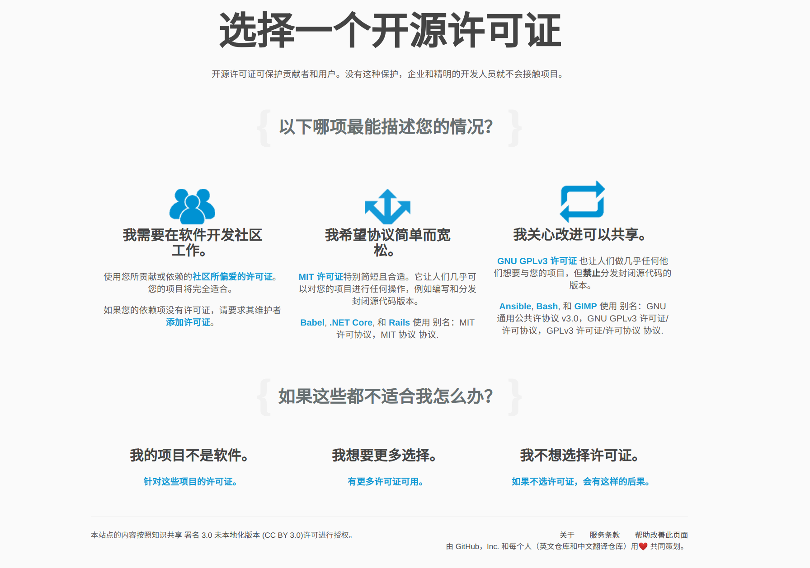

# 选择一个开源许可证

如果我们经常使用开源项目，那么对开源许可证并不陌生，例如 Rust 的编译器源文件采取了 Apache 2.0 和 MIT 两个许可协议进行授权。因为 Rust 官方开放的项目中一般均采用上述两者协议共同授权，所以我们见到不少 Rust crate 的源程序也一样采取了双协议授权，或是 Apache 2.0 或 MIT 之中的一个，尤其 MIT 的最多。

但有时以上两个协议并不符合我们的项目要求，比如我们不希望用户修改我们代码后闭源，那我们可以使用 GPLv3 协议对我们的软件代码授权；有时我们要发布一些文档类的文件，而前面的许可证适用于软件项目却不适合书籍类型，那么我们可以采取知识共享-署名 4.0 国际（CC BY-4.0）协议进行授权；甚至我们希望自己的作品能够分享出去让其他人不受任何限制使用，那么我们就可以采取 CC0 1.0 知识共享通用协议，从而声明属于公共领域作品……

为了方便大家更方便地根据自己的项目特性选取开源许可证，GitHub 推出了专门帮助开发者选择合适许可证的[ChooseALicense.com 网站](https://choosealicense.com/)，网站简单明了。很遗憾，这个网站没有对应中文版，而且中文的网站中，也几乎找不到一个详尽说明软件项目要怎样选取合适开源许可证的网站。为此，[Rust 中文翻译项目组](https://github.com/rust-lang-cn)的 [Aaran Xu](https://github.com/aaranxu) 将 ChooseALicense.com 网站翻译成中文（如下图所示），中文网址为：

选择一个开源许可证中文网站：<https://choosealicense.rustwiki.org>

希望网站能够提供给中文用户高效便捷地选择到合适的开源许可协议。

若是发现网站有哪些错误或不足，随时欢迎指出并在[本网站项目仓库](https://github.com/choosealicense-cn.github.io)中发起 Issue 或 PR，感激不尽。
